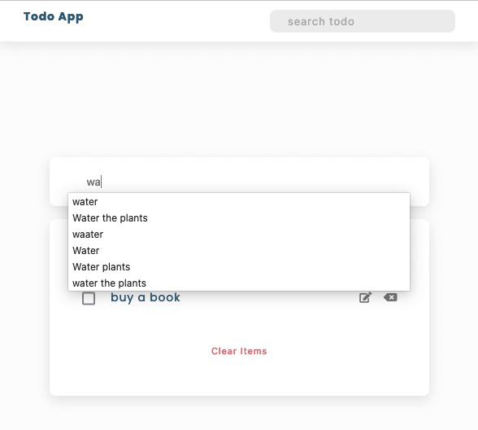

# todo-app

JavaScript todo-app which able to add, edit, delete, search items and save the data in the local storage

### Mathod I used

- filter()
- match()
- forEach()
- createAttribute()
- setTimeout()
- new RegExp()
- JSON.parse()
- JSON.stringify()
- localStorage.getItem()
- localStorage.setItem()

